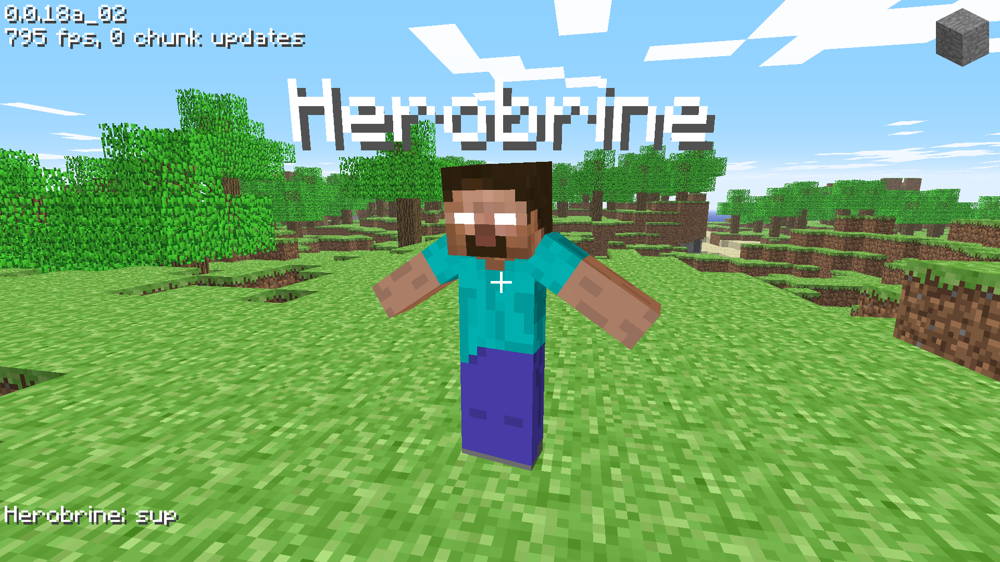
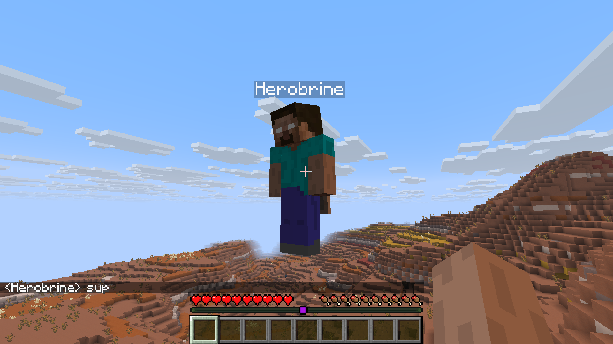

# Loki

Patch (nearly) any Minecraft version to use custom API servers




## Supported versions

Skins/capes: c0.0.18a and above

Authentication: a1.0.16 and above

Skin support was added to the game in c0.0.18a. Although multiplayer was reintroduced in a1.0.15, a1.0.16 implemented
online mode functionality. This means that Loki effectively supports every Minecraft version.

## Wait, what about classic servers?

Classic servers use the [Classic Protocol](https://minecraft.wiki/w/Minecraft_Wiki:Projects/wiki.vg_merge/Classic_Protocol), and while this may be supported in the future, as of now there is
little incentive to do so due to the availability of significantly better clones like [ClassiCube](https://www.classicube.net/).

## Are total conversion mods or obscure mod loaders supported?

They should be, but if not, please file an issue.

## Does chat reporting/secure-profile work?

It does, as long as you're on the same API server and your API server supports chat reporting. While using Loki, the player signature is not validated, even with `enforce-secure-profile=true` in `server.properties` - it only requires that a signature is provided. In this state, [No Chat Reports](https://modrinth.com/mod/no-chat-reports) will not work, but signatures could potentially be forged unless you additionally set `-DLoki.enforce_secure_profile=true`. Doing this will, however, kick [fallback API server](https://github.com/unmojang/drasl/blob/master/doc/configuration.md) players, and is discouraged (see "Chat validation error" Troubleshooting section below). You can even do chat reports across API servers, the API server will of course reject the attempt to make the report though.


## JVM arguments

Loki supports JVM arguments to enable or disable some behaviour.

- Use Authlib-Injector URL instead of `minecraft.api.*.host` parameters
  ```
  -DLoki.url=https://drasl.unmojang.org
  ```

- Enable debug mode (increased verbosity)
  ```
  -DLoki.debug=true
  ```

- Enable trace mode (maximum verbosity)
  ```
  -DLoki.trace=true
  ```

- Disable the URL factory
  ```
  -DLoki.disable_factory=true
  ```

- Disable realms APIs
  ```
  -DLoki.disable_realms=true
  ```

- Re-enable patchy (server blocking)
  ```
  -DLoki.enable_patchy=true
  ```

- Re-enable snooper
  ```
  -DLoki.enable_snooper=true
  ```

- Require valid chat signatures on 1.19+ servers where `enforce-secure-profile=true` is set in `server.properties` [^1]
  ```
  -DLoki.enforce_secure_profile=true
  ```

- Re-enable modded capes with username-based lookups (OptiFine, Cloaks+, etc.)
  ```
  -DLoki.modded_capes=true
  ```

- Re-enable the username validation added in 1.18.2 that kicks usernames containing invalid characters
  ```
  -DLoki.username_validation=true
  ```

## Troubleshooting

### Fallback API server (Mojang, etc) players see "Chat validation error" in chat messages

Whenever anyone from a different API server talks in chat, fallback API server players may see "Chat validation error" and be unable to send messages afterward until they relog. This is due to the vanilla 1.19+ game client performing signature checks on messages prior to accepting them. The solution is to either use Loki or authlib-injector on the client - which will most likely already be in use unless the fallback API server is Mojang - or to disable `enforce-secure-profile` in `server.properties` on the server.

[^1]: This option is **NOT** necessary to ensure the integrity of chat reports made to the API server from clients, and will kick [fallback API server](https://github.com/unmojang/drasl/blob/master/doc/configuration.md) players.