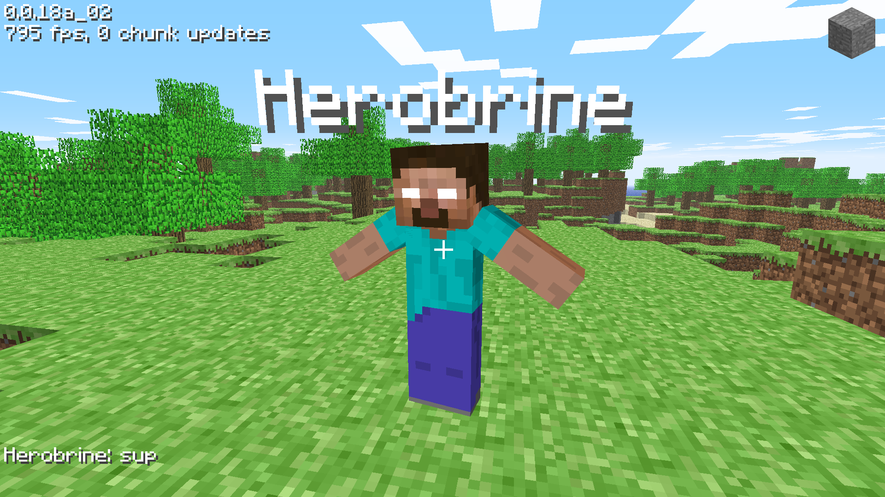
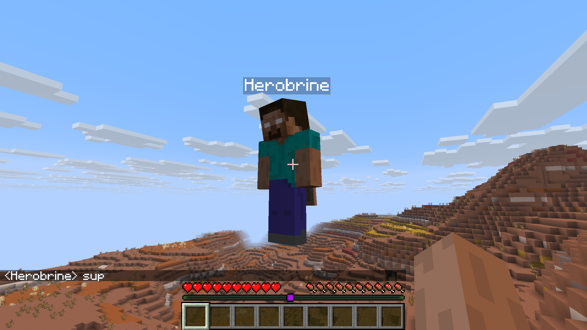

# Loki

Patch (nearly) any Minecraft version to use custom API servers

## Usage

See [doc/usage.md](doc/usage.md) to learn how to use Loki on clients and servers.

## Configuration

See [doc/configuration.md](doc/configuration.md) for documentation of the configuration options.

## Troubleshooting

[doc/troubleshooting.md](doc/troubleshooting.md) has some helpful tips, but it's not complete. Feel free to file an issue if you're having problems.

## Building

Loki should be built with Java 8. Adjust either the `JDK8_HOME` or the `JAVA_HOME` environment variable accordingly.

Install Apache Ant, and run `ant ivy` to fetch Apache Ivy; you only need to do this once.

Run `ant` to build. Your compiled jar will be placed in `build/dist/Loki-x.x.x.jar`.

You *can* build with Java 9 or later, however your build will lack Java 5-7 support. To do this, use `ant -DjavaTarget=1.8`

## FAQ
See [doc/faq.md](doc/faq.md)
